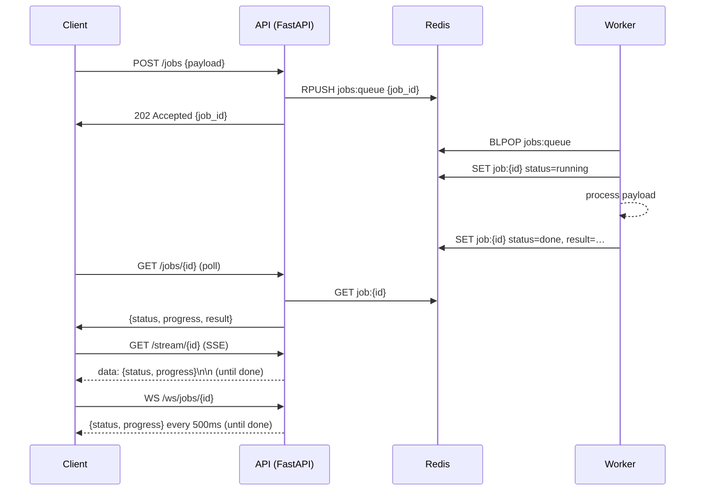

# async-endpoints

> A hands-on reference for async API patterns that actually run.

I kept running into the same problem at work: long-running operations that either timed out or left clients hanging. The synchronous request-response model breaks down the moment a job takes more than a second or two. So I built this project to nail down the patterns I reach for when that happens — all wired together, Dockerized, and tested.

## What's in here

- 202 Accepted + poll pattern
- Server-Sent Events (SSE)
- WebSockets
- Redis-backed task queue with background workers
- Circuit breaker state machine
- Exponential backoff retry decorator with jitter
- Idempotency keys
- OpenTelemetry tracing


If you're copying a pattern from here into a real service, the `examples/` directory is the fastest path — each script is self-contained and runs against the Docker setup with zero changes.

## Patterns at a glance

| Pattern | Endpoint | When I use it |
|---|---|---|
| 202 Accepted + poll | `POST /jobs` → `GET /jobs/{id}` | Client controls the check cadence; simplest to implement |
| Server-Sent Events | `GET /stream/{job_id}` | Server pushes updates; client only needs to listen |
| WebSocket | `WS /ws/jobs/{job_id}` | Bidirectional, low-latency; good for interactive dashboards |
| Redis task queue | internal | Decouples API from work; survives restarts |
| Circuit breaker | `app/core/circuit_breaker.py` | Stops hammering a flaky downstream service |
| Exponential backoff | `app/core/retry.py` | Retries with jitter so bursts don't overwhelm |
| Idempotency keys | `Idempotency-Key` header | Safe to retry `POST /jobs` without duplicating work |
| OpenTelemetry tracing | `app/core/tracing.py` | Trace spans across the API → queue → worker boundary |

## Quick start

You need Docker and Docker Compose. That's it.

```bash
git clone https://github.com/omprxkash/async-endpoints.git
cd async-endpoints
cp .env.example .env
docker compose up
```

Three services come up: **redis**, **api** (port 8000), and **worker**. Once they're running, try each client:

```bash
# Install client deps (only needed for the example scripts)
pip install httpx websockets

# Submit a job and poll until done
python examples/poll_client.py

# Watch progress over Server-Sent Events
python examples/sse_client.py

# Stream live status over a WebSocket
python examples/ws_client.py
```

## How it works



The API and worker share a Redis instance. The API writes jobs to a list; the worker pops them with `BLPOP`, processes them step-by-step, and writes progress back. The SSE and WebSocket endpoints poll Redis on a tight loop and push whatever they find.

Tracing ties it together: the API injects an OpenTelemetry trace context into the job payload before enqueuing, and the worker extracts it when it picks up the job — so you get a single trace spanning both processes.

## Endpoints

| Method | Path | Description |
|---|---|---|
| `POST` | `/jobs` | Submit a job, get back a `job_id`. Supports `Idempotency-Key` header. |
| `GET` | `/jobs/{job_id}` | Poll current status: `queued`, `running`, `done`, or `failed`. |
| `GET` | `/stream/{job_id}` | SSE stream. Pushes a `data:` event every ~500 ms until the job finishes. |
| `WS` | `/ws/jobs/{job_id}` | WebSocket. Sends a JSON message every ~500 ms. Heartbeat ping every 15 s. |
| `GET` | `/healthz` | Simple health check. |

## Project structure

```
async-endpoints/
├── app/
│   ├── main.py                  # FastAPI app, lifespan, router registration
│   ├── config.py                # Settings from environment (pydantic-settings)
│   ├── models/
│   │   └── schemas.py           # JobCreate, JobStatus
│   ├── core/
│   │   ├── queue.py             # enqueue / dequeue / get_status / set_status
│   │   ├── worker.py            # blocking worker loop
│   │   ├── circuit_breaker.py   # CLOSED → OPEN → HALF_OPEN state machine
│   │   ├── retry.py             # @retry decorator with exponential backoff + jitter
│   │   ├── idempotency.py       # idempotency key store (Redis)
│   │   └── tracing.py           # OpenTelemetry setup + context propagation
│   └── routers/
│       ├── jobs.py              # POST /jobs + GET /jobs/{id}
│       ├── stream.py            # GET /stream/{job_id}  (SSE)
│       └── websocket.py         # WS /ws/jobs/{job_id}
├── examples/
│   ├── poll_client.py
│   ├── sse_client.py
│   └── ws_client.py
├── tests/
│   ├── test_jobs.py
│   ├── test_circuit_breaker.py
│   ├── test_retry.py
│   └── test_sse.py
├── docker-compose.yml
├── Dockerfile
├── requirements.txt
└── .env.example
```

## Running the tests

```bash
pip install -r requirements.txt
pytest
```

The tests mock Redis with an in-memory dict so you don't need a running Redis instance. Circuit breaker and retry tests are pure unit tests — no I/O at all.

## Configuration

Copy `.env.example` to `.env` and adjust as needed:

| Variable | Default | Description |
|---|---|---|
| `REDIS_URL` | `redis://localhost:6379/0` | Redis connection string |
| `OTEL_EXPORTER` | `console` | Currently only `console` is wired up |
| `PORT` | `8000` | Port uvicorn binds to |

## Circuit breaker and retry

The circuit breaker (`app/core/circuit_breaker.py`) is a plain state machine — no external dependency:

```python
from app.core.circuit_breaker import CircuitBreaker

cb = CircuitBreaker(failure_threshold=5, cooldown=30.0)
result = cb.call(my_downstream_function, arg1, arg2)
```

The retry decorator lives in `app/core/retry.py`:

```python
from app.core.retry import retry

@retry(max_attempts=4, backoff_base=0.5, jitter=True, on_exceptions=(IOError,))
def call_flaky_service():
    ...
```

## Known limitations

- The worker is a single-threaded blocking loop. To handle more jobs concurrently, run multiple worker replicas (`docker compose up --scale worker=3`).
- OpenTelemetry is wired to the console exporter by default — useful for development, but you'll want to swap in an OTLP exporter for any real environment.
- There's no authentication on any endpoint. Add an API key middleware or OAuth before exposing this to the internet.
- Job results are stored in Redis with a 1-hour TTL. Adjust `job_ttl` in `config.py` if you need longer retention.

## Contributing

Issues and PRs are welcome. Keep changes focused — one pattern or improvement per pull request makes review a lot easier.

**Author:** [omprxkash](https://github.com/omprxkash)
